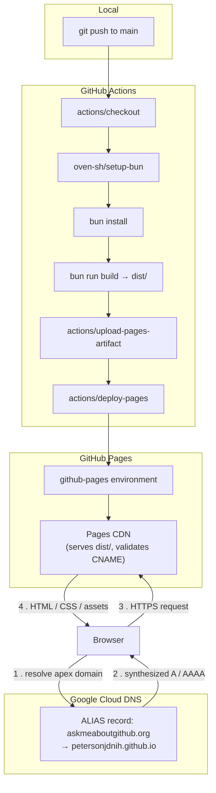

# askmeaboutgithub.org

Static site built with [Astro](https://astro.build), served via GitHub Pages.

## Stack

- **Astro 4** (`output: 'static'`) renders the site to plain HTML at build time. There is a single route, [src/pages/index.astro](src/pages/index.astro), which composes the page inside [src/layouts/Layout.astro](src/layouts/Layout.astro).
- **Sass** compiles [src/styles/home.scss](src/styles/home.scss), imported directly from the page's frontmatter. This is a global (unscoped) stylesheet, as opposed to an Astro `<style>` block, which Astro would otherwise auto-scope with a `data-astro-cid-*` attribute.
- **Bun** is the package manager and script runner (`bun install`, `bun run dev`, `bun run build`). There is no npm/yarn lockfile; only `bun.lock`.
- No client-side framework or hydration. The only inline JavaScript is a small `<script>` in `index.astro` that toggles a `data-theme` attribute on `<html>` and persists the choice to `localStorage`, plus an inline blocking script in the layout `<head>` that reads that value before first paint to avoid a flash of the wrong theme.

## Theming

Both color themes are defined as CSS custom properties scoped to `html[data-theme='dark']` and `html[data-theme='light']` in `Layout.astro`. Components reference the properties (`var(--color-accent)`, etc.) rather than hardcoded colors, so the toggle in `index.astro` only needs to flip the `data-theme` attribute; no re-render or JS-driven restyling is involved.

## Icons

The octocat icon exists as a single file, [public/octocat.svg](public/octocat.svg). It's applied via a CSS mask (`.icon-octocat` in `home.scss`): the element's `background-color` is set to `currentColor` and the SVG is used as a `mask-image`. This lets the icon inherit and animate with whatever color its containing element has (including the hover animation described below) without inlining the SVG markup in every location it's used.

## Deployment and hosting



[.github/workflows/deploy.yml](.github/workflows/deploy.yml) runs on every push to `main`:

1. `build` job: checks out the repo, installs Bun via `oven-sh/setup-bun`, runs `bun install` and `bun run build`, then uploads `./dist` as a Pages artifact.
2. `deploy` job: takes that artifact and publishes it with `actions/deploy-pages`, targeting the `github-pages` environment.

The custom domain is set via [public/CNAME](public/CNAME), which Astro copies into `dist/` unchanged as a static asset. GitHub Pages reads that file to confirm the incoming request's `Host` header is a domain it's authorized to serve, and issues its TLS certificate for it.

### DNS: ALIAS record and CNAME flattening

The zone for `askmeaboutgithub.org` is hosted on Google Cloud DNS. The apex (root) record can't be a plain `CNAME`, since the DNS spec forbids a `CNAME` from coexisting with any other record type at the zone apex, including the `SOA` and `NS` records every zone requires. GitHub Pages, however, only publishes a hostname (`petersonjdnih.github.io`) for custom domains, not a fixed set of IPs guaranteed to stay stable forever.

Cloud DNS's `ALIAS` record type resolves that conflict. It's configured at the apex exactly like a `CNAME` (target: `petersonjdnih.github.io`), but instead of being handed to the client, Cloud DNS's own name servers resolve the target hostname to its current `A`/`AAAA` records at query time and return those directly. This is the technique commonly called CNAME flattening: the client only ever sees an `A`/`AAAA` answer, so the record is legal at the apex, but it still tracks GitHub's IPs automatically if they change. The tradeoff is that `ALIAS` records are a Cloud DNS-specific construct with no DNSSEC support; they never appear as `ALIAS` to an external resolver, only as synthesized address records.

## Local development

```bash
bun install
bun run dev      # dev server with HMR
bun run build    # outputs to dist/
bun run preview  # serve the production build locally
```
